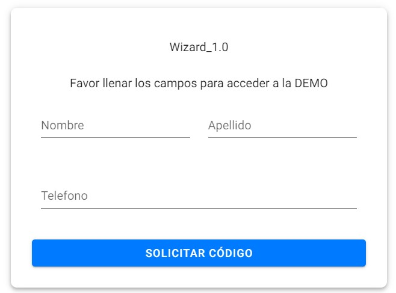
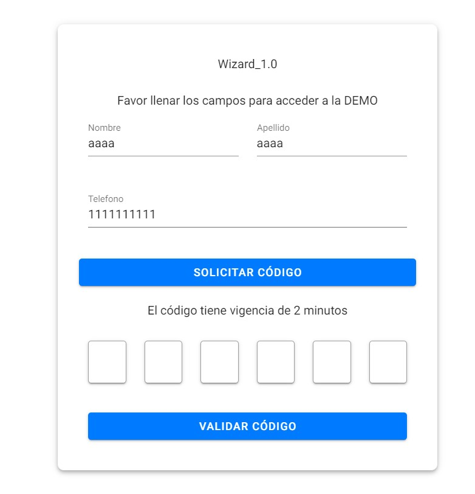
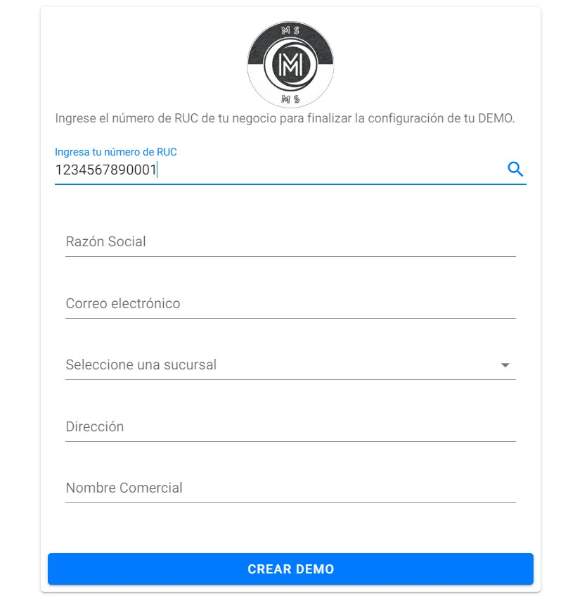

# Wizard

## Descripción
Wizard es un proyecto desarrollado en Vue.js, JavaScript y HTML. 






## Tecnologías Utilizadas
- **Vue.js:** 60.3%
- **JavaScript:** 35.7%
- **HTML:** 4.0%

## Instalación
Para instalar y ejecutar este proyecto localmente, sigue estos pasos:

1. Clona el repositorio:
   ```sh
   git clone https://github.com/Paulo1603C/Wizard.git

2. Navega al directorio del proyecto:
   ```sh
    cd Wizard

4. Instala las dependencias:
   ```sh
   npm install

6. Ejecuta el proyecto:
   ```sh
   npm run serve

